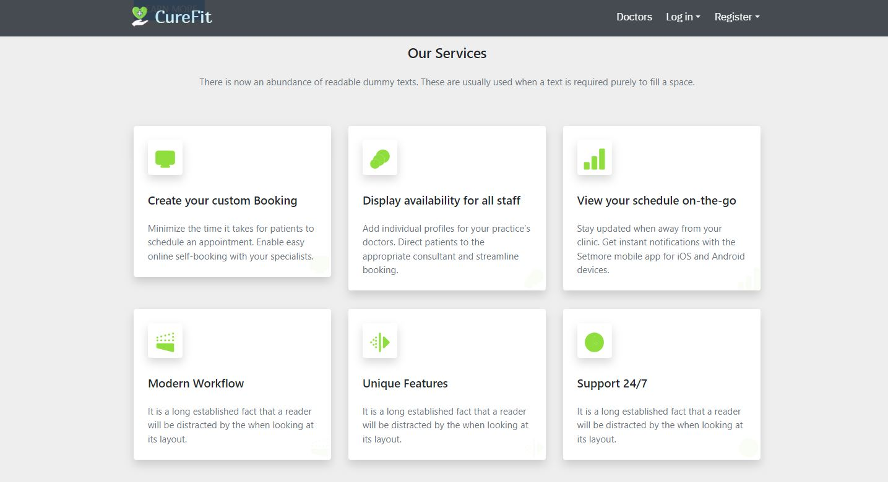
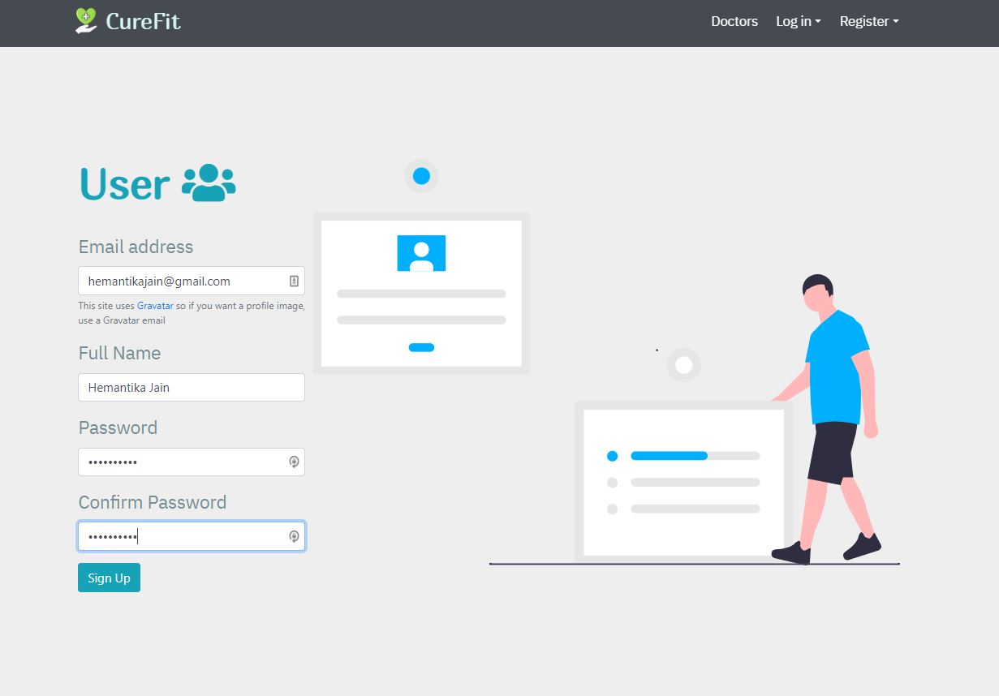
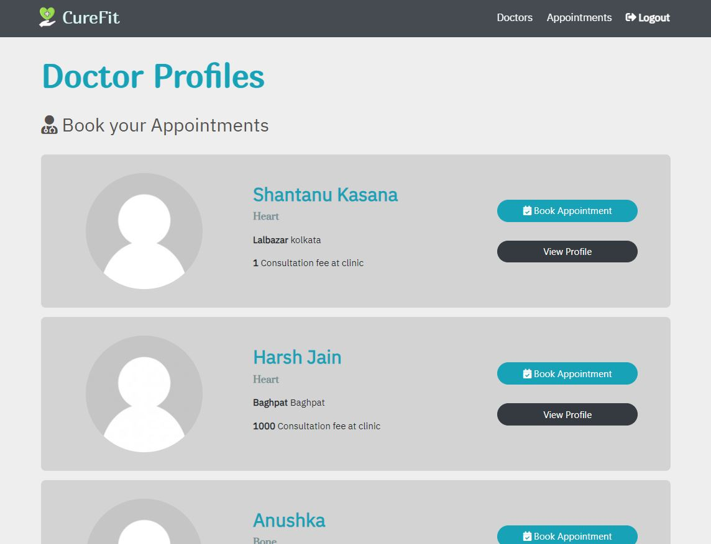
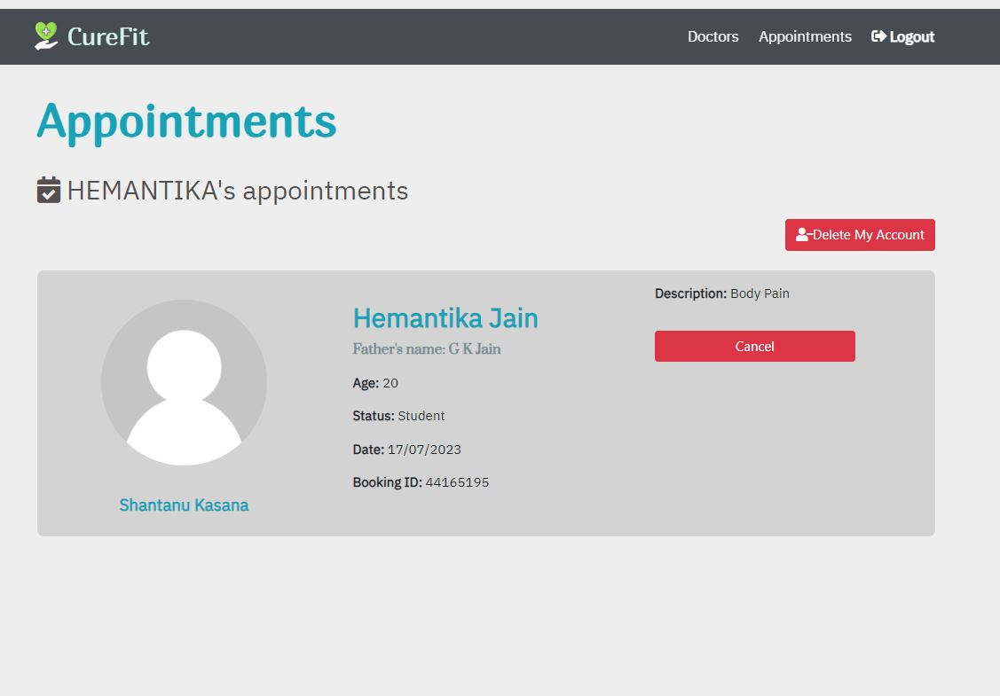
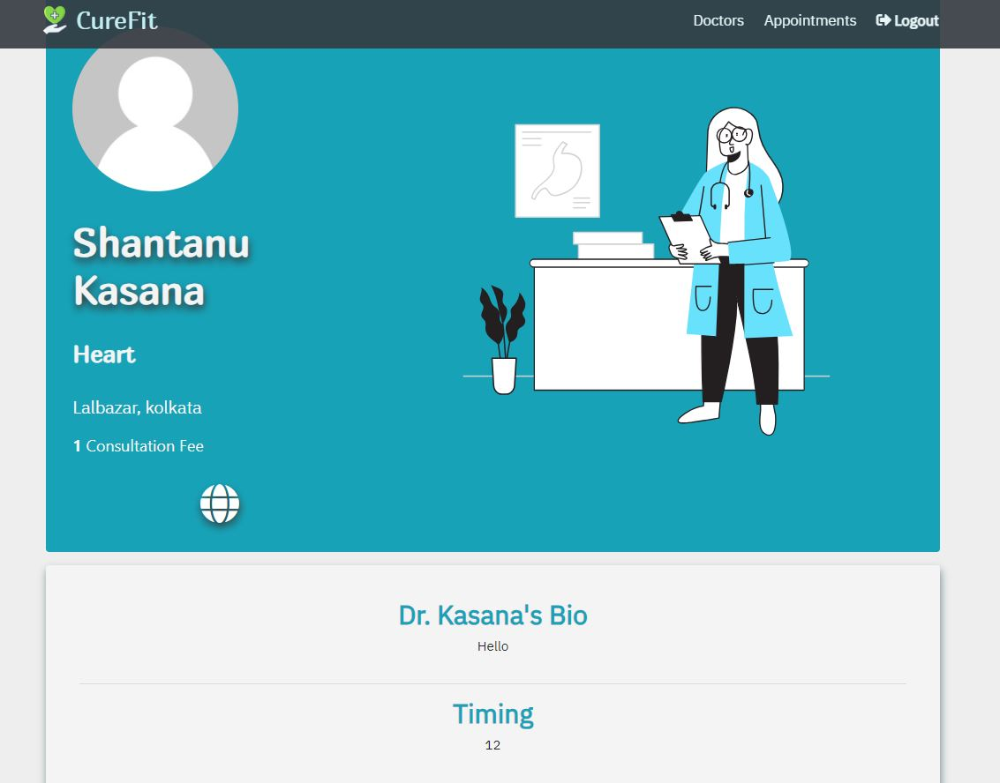
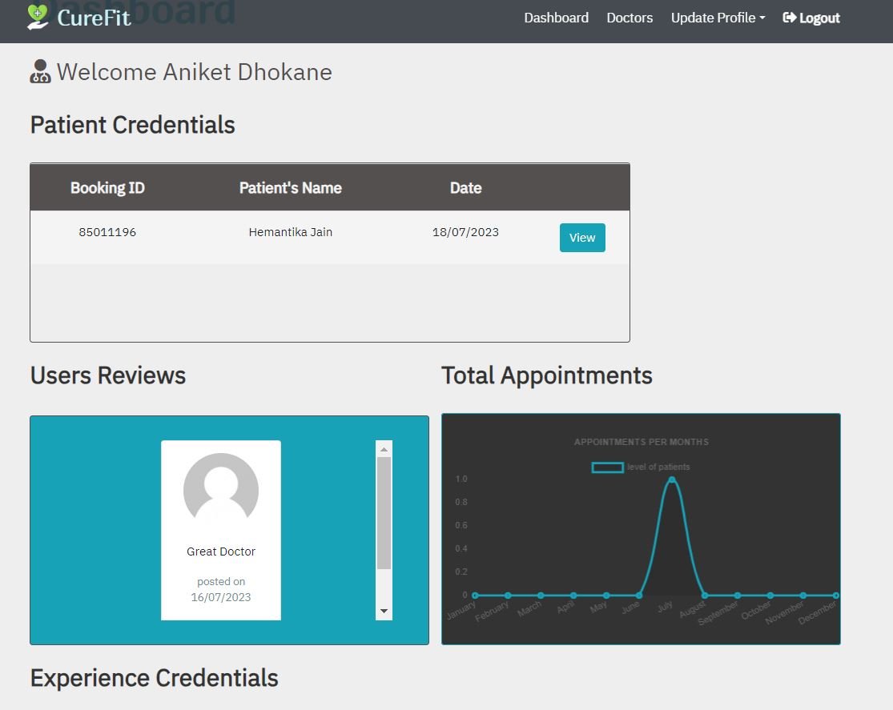

# Cure-Fit

Cure-Fit is a full-stack web application built on the MERN (MongoDB, Express, React, Node.js) stack, designed to streamline the process of scheduling doctor appointments. It provides a user-friendly platform where doctors and patients can interact to manage appointments conveniently and efficiently.

## Features

- Doctor and User Login: The system offers separate login functionality for doctors and users. Doctors can access their accounts to manage their availability and appointment schedules, while users can log in to book appointments with their preferred doctors.

- Doctor Profile and Appointment Management: Doctors can create and update their profiles, including information such as their specialization, contact details, and working hours. They can also set available time slots for appointments, ensuring accurate scheduling and avoiding conflicts.

- User Appointment Booking: Users can browse through the list of available doctors, view their profiles, and select the desired doctor based on specialization and location. They can then choose from the available appointment slots and book an appointment conveniently.

- Appointment Statistics and Charts: The system provides comprehensive statistics and charts to showcase a doctor's overall performance. Users and doctors can view the number of patients who have booked appointments with a particular doctor, helping users make informed decisions and allowing doctors to track their popularity and demand.

- User Reviews and Comments: After visiting a doctor, users can leave reviews and comments to share their experiences. This feature allows users to provide feedback on the quality of care and helps other users make informed decisions when selecting doctors.

- Authentication and Security: Cure-Fit incorporates a robust authentication system to ensure secure access and protect sensitive information. User passwords are encrypted and stored securely, and appropriate measures are taken to prevent unauthorized access.

## Tech Stack

**Frontend:** The frontend of the Cure-Fit system is developed using React.js, a popular JavaScript library for building user interfaces. It offers a responsive and intuitive user experience, making appointment booking and management seamless.

**Backend:** The backend of the system is built using Node.js and Express.js, providing a robust and scalable server-side framework. It handles the business logic, API endpoints, and data processing for user authentication, appointment scheduling, and statistics generation.

**Database:** Cure-Fit utilizes MongoDB, a NoSQL database, to store and manage doctor profiles, appointment details, user information, and user reviews. MongoDB offers flexibility and scalability, allowing efficient storage and retrieval of data.

**Charts and Data Visualization:** The system employs data visualization libraries, such as Chart.js or D3.js, to generate interactive charts and graphs that showcase appointment statistics and doctor performance. These visual representations help users and doctors quickly analyze and understand the data

## Screenshots

## Acknowledgements

Cure-Fit is inspired by the need for a reliable and user-friendly doctor appointment system. We would like to thank the open-source community and all contributors for their valuable resources and support. Together, we strive to enhance healthcare accessibility and improve the lives of both doctors and patients.

## Feedback

If you have any feedback, please reach out to me at tejeshjain2521@gmail.com

